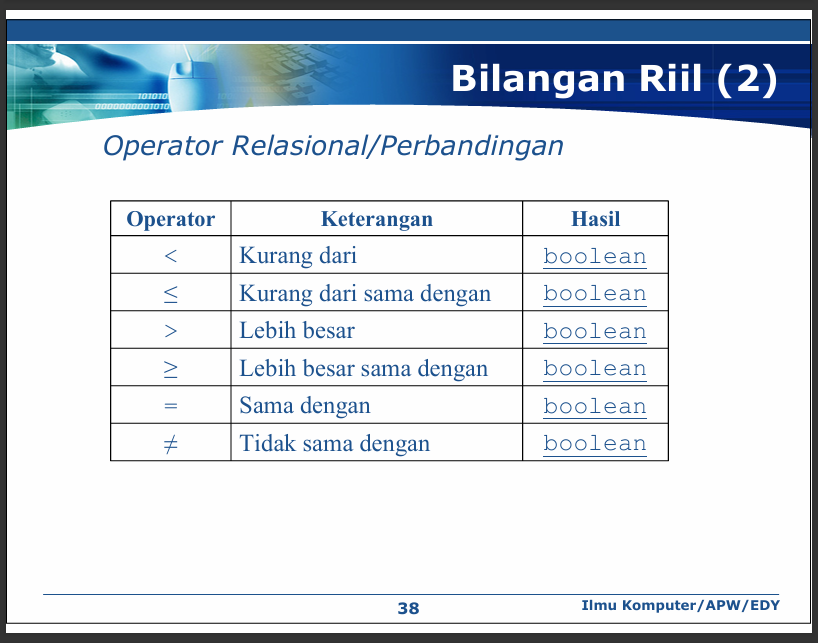

# PENGERTIAN 





# SOAL LATIHAN ALGORITMA DAN PEMROGRAMAN (Bagian materi Tabel)

## Buatlah sebuah teks algoritma dengan menggunakan notasi algoritmik dan terjemahkan ke dalam bahasa C untuk persoalan-persoalan dibawah ini.


### 1.	Diberikan Tabel T yang berisi bilangan integer sembarang lebih besar nol, maka buatlah teks algoritma untuk menampilkan nilai maksimum ke-2. <Nama File: NilMax2Tabel>

Example: tabel T berisi {7,4,5,7,6,5,3,5,1,4} maka nilai maksimum ke-2 adalah 6

```c
#include <stdio.h>

int main() {
    int T[100], N;
    int i;
    int max = -999999, max2 = -999999;

    printf("Masukkan jumlah data T: ");
    scanf("%d", &N);

    for (i = 0; i < N; i++) {
        scanf("%d", &T[i]);
    }

    for (i = 0; i < N; i++) {
        if (T[i] > max) {
            max2 = max;
            max = T[i];
        } else if (T[i] < max && T[i] > max2) {
            max2 = T[i];
        }
    }

    printf("Nilai maksimum ke-2: %d\n", max2);
    return 0;
}

```


### 2. Diberikan Tabel T yang berisi bilangan integer sembarang lebih besar nol, maka buatlah teks algoritma untuk menampilkan nilai elemen tabel T yang frekuensi kemunculannya lebih dari satu kali. <Nama File: FrekNilTabel>

Example: tabel T berisi {7,4,5,7,6,5,3,5,1,4} maka elemen tabel T yang akan tampil {7,4,5}  

```c
#include <stdio.h>

int main() {
    int T[100], N;
    int i, j, k, count, isAlreadyPrinted;

    printf("Masukkan jumlah data T: ");
    scanf("%d", &N);

    for (i = 0; i < N; i++) {
        scanf("%d", &T[i]);
    }

    printf("Elemen yang muncul lebih dari satu kali:\n");
    for (i = 0; i < N; i++) {
        count = 0;
        for (j = 0; j < N; j++) {
            if (T[i] == T[j]) {
                count++;
            }
        }

        isAlreadyPrinted = 0;
        for (k = 0; k < i; k++) {
            if (T[i] == T[k]) {
                isAlreadyPrinted = 1;
            }
        }

        if (count > 1 && isAlreadyPrinted == 0) {
            printf("%d ", T[i]);
        }
    }

    return 0;
}

```

### 3.	Diberikan Tabel T yang berisi bilangan integer sembarang lebih besar nol, maka buatlah teks algoritma untuk menampilkan jumlah nilai-nilai elemen tabel T yang frekuensi kemunculannya lebih dari satu kali. <Nama File: JumFrekNilTabel>

Example: tabel T berisi {7,4,5,7,6,5,3,5,1,4}, maka jumlah elemen tabel T yang frekuensi kemunculannya lebih dari satu kali adalah 7+7+4+4+5+5+5 = 37

```c
#include <stdio.h>

int main() {
    int T[100], N;
    int i, j, k, count, isAlreadyAdded;
    int sum = 0;

    printf("Masukkan jumlah data T: ");
    scanf("%d", &N);

    for (i = 0; i < N; i++) {
        scanf("%d", &T[i]);
    }

    for (i = 0; i < N; i++) {
        count = 0;
        for (j = 0; j < N; j++) {
            if (T[i] == T[j]) {
                count++;
            }
        }

        isAlreadyAdded = 0;
        for (k = 0; k < i; k++) {
            if (T[i] == T[k]) {
                isAlreadyAdded = 1;
            }
        }

        if (count > 1 && isAlreadyAdded == 0) {
            sum += T[i] * count;
        }
    }

    printf("Jumlah nilai-nilai yang frekuensinya >1: %d\n", sum);
    return 0;
}

```

### 4.	Diberikan tabel T1 dan T2 yang berisi bilangan integer sembarang lebih besar nol, serta diberikan ukuran tabel T2 dan T2, maka buatlah teks algoritma untuk menentukan bahwa T1 dan T2 simetri atau tidak. Simetri adalah ukurannya sama dan nilai pada setiap elemen tabel T1 dan T2 juga sama. <<Nama File: SimetriTabel>>

Example: 
- Tabel T1 berisi {7,4,5,7,6,5,3,5,1,4} ukuran T1=10, dan T2 berisi {7,4,5,7,6,5,3,5,1,4} ukuran T2=10, maka T1 dan T2 Simetri.
- Tabel T1 berisi {7,4,5,7,6,5,3,5,1,4} ukuran T1=10, dan T2 berisi {7,4,5,12,6,5,3,5,1,4} ukuran T2=10, maka T1 dan T2 Tidak Simetri.
- Tabel T1 berisi {7,4,5,7,6,5,1,4} ukuran T1=8, dan T2 berisi {7,4,5,7,6,5,3,5,1,4} ukuran T2=10, maka T1 dan T2 Tidak Simetri.


```c
#include <stdio.h>

int main() {
    int T1[100], T2[100];
    int N1, N2;
    int i;
    int isSimetri = 1; // Asumsikan simetri dulu

    printf("Masukkan ukuran T1: ");
    scanf("%d", &N1);
    printf("Masukkan elemen-elemen T1:\n");
    for (i = 0; i < N1; i++) {
        scanf("%d", &T1[i]);
    }

    printf("Masukkan ukuran T2: ");
    scanf("%d", &N2);
    printf("Masukkan elemen-elemen T2:\n");
    for (i = 0; i < N2; i++) {
        scanf("%d", &T2[i]);
    }

    if (N1 != N2) {
        isSimetri = 0;
    } else {
        for (i = 0; i < N1; i++) {
            if (T1[i] != T2[i]) {
                isSimetri = 0;
            }
        }
    }

    if (isSimetri == 1) {
        printf("T1 dan T2 Simetri.\n");
    } else {
        printf("T1 dan T2 Tidak Simetri.\n");
    }

    return 0;
}

```


### 5.  **Diberikan tabel T (2 dimensi)** yang berisi bilangan integer sembarang lebih besar nol, maka buatlah teks algoritma untuk menjumlahkan semua elemen pada baris dan kolomnya  **<<Nama File: JumBarKolMat>>**

Contoh Example:  
T =  
```
[1 3 5]  
[2 5 2]  
[4 2 4]
```

Maka akan menampilkan sebagai berikut:  
- Baris ke-1 ➔ 1 + 3 + 5 = **9**  
- Baris ke-2 ➔ 2 + 5 + 2 = **9**  
- Baris ke-3 ➔ 4 + 2 + 4 = **10**  
- Kolom ke-1 ➔ 1 + 2 + 4 = **7**  
- Kolom ke-2 ➔ 3 + 5 + 2 = **10**  
- Kolom ke-3 ➔ 5 + 2 + 4 = **11**


```c
#include <stdio.h>

int main() {
    int T[100][100];
    int baris, kolom;
    int i, j;

    printf("Masukkan jumlah baris: ");
    scanf("%d", &baris);
    printf("Masukkan jumlah kolom: ");
    scanf("%d", &kolom);

    // Input elemen tabel
    for (i = 0; i < baris; i++) {
        for (j = 0; j < kolom; j++) {
            printf("Masukkan elemen T[%d][%d]: ", i, j);
            scanf("%d", &T[i][j]);
        }
    }

    // Jumlahkan tiap baris
    for (i = 0; i < baris; i++) {
        int sumBaris = 0;
        printf("Baris ke-%d ➔ ", i + 1);
        for (j = 0; j < kolom; j++) {
            sumBaris += T[i][j];
            printf("%d", T[i][j]);
            if (j < kolom - 1) printf(" + ");
        }
        printf(" = %d\n", sumBaris);
    }

    // Jumlahkan tiap kolom
    for (j = 0; j < kolom; j++) {
        int sumKolom = 0;
        printf("Kolom ke-%d ➔ ", j + 1);
        for (i = 0; i < baris; i++) {
            sumKolom += T[i][j];
            printf("%d", T[i][j]);
            if (i < baris - 1) printf(" + ");
        }
        printf(" = %d\n", sumKolom);
    }

    return 0;
}
```

### 6.	Buatlah teks algoritma untuk mengisikan nilai pada elemen-elemen matrik yang memiliki ordo sama (M x N) dengan aturan bahwa nilai 1 diisikan pada elemen-elemen diagonal utama, nilai 0 diisikan pada elemen-elemen di atas diagonal utama, dan nilai 2 diisikan pada elemen-elemen di bawah diagonal utama. Nilai M dan N integer sembarang ( M > 0 dan N > 0) yang dimasukan melalui keyboard. Nilai M dan N harus bernilai sama, jika tidak sama maka akan menampilkan pesan “Nilai M dan N harus sama” <<Nama File: IsiMatrik>>

```c
#include <stdio.h>

int main() {
    int M, N;
    int i, j;

    printf("Masukkan nilai M: ");
    scanf("%d", &M);
    printf("Masukkan nilai N: ");
    scanf("%d", &N);

    // Periksa apakah M dan N sama
    if (M != N) {
        printf("Nilai M dan N harus sama\n");
        return 0;
    }

    int matriks[M][N];

    // Proses pengisian matriks
    for (i = 0; i < M; i++) {
        for (j = 0; j < N; j++) {
            if (i == j) {
                matriks[i][j] = 1;
            } else if (i < j) {
                matriks[i][j] = 0;
            } else {
                matriks[i][j] = 2;
            }
        }
    }

    // Tampilkan hasil matriks
    printf("Hasil matriks:\n");
    for (i = 0; i < M; i++) {
        for (j = 0; j < N; j++) {
            printf("%d ", matriks[i][j]);
        }
        printf("\n");
    }

    return 0;
}
```

# SOAL LATIHAN ALGORITMA DAN PEMROGRAMAN

## (Bagian materi Sub Program)


### Nomor 1

```c
Function NBElmt (T: TabInt) -> integer
{mengirimkan banyaknya elemen efektif tabel T, jika T kosong maka NBElmt=0*/}

{Kamus Lokal}
    type TabInt <
            IdxMin: integer, {minimal / index pertama elemen tabel}
            IdxMax: integer, {maksimal / index terakhir elemen tabel}
            TI: array [IdxMin..IdxMax] of integer, {elemen tabel}
            NEff: integer {index efektif tabel}
            >

{Algoritma}
    output(T.NEff);
```

### Nomor 2 

```c
Function IdxLast (T: TabInt) -> integer
{mengirimkan nilai index efektif (NEff) tabel T sebagai elemen terakhir*/}

{Kamus Lokal}
    type TabInt <
            IdxMin: integer, {minimal / index pertama elemen tabel}
            IdxMax: integer, {maksimal / index terakhir elemen tabel}
            TI: array [IdxMin..IdxMax] of integer, {elemen tabel}
            NEff: integer {index efektif tabel}
            >
  
{Algoritma}
    output(T.NEff - 1);
```

### Nomor 3

```c
Function IsEqual(T1: TabInt, T2: TabInt) -> Boolean
{Mengirimkan true apabila ukuran T1 dan T2 sama, dan setiap}
{elemen T1 dan T2 dengan indeks yang sama bernilai sama}

{Kamus Lokal}
    type TabInt <
            IdxMin: integer, {minimal / index pertama elemen tabel}
            IdxMax: integer, {maksimal / index terakhir elemen tabel}
            TI: array [IdxMin..IdxMax] of integer, {elemen tabel}
            NEff: integer {index efektif tabel}
            >
    i : integer

{Algoritma}
    if (T1.NEff = T2.NEff) then
        i traversal [IdxMin..T1.NEff]
            if (T1.TI[i] ≠ T2.TI[i]) then
                output(false)
                stop
        output(true)  
    else
        output(false)
```

### Nomor 4

```c
Function SearchIdx(T: TabInt, X: ElmtType) -> IdxType
{Mengirimkan indeks terkecil dimana ditemukan X dalam T,     }
{jika tidak ditemukan menghasilkan index tak terdefinisi (-999).}
{Memakai skema search tanpa Boolean.                         }

{Kamus Lokal}
    type TabInt <
            IdxMin: integer, {minimal / index pertama elemen tabel}
            IdxMax: integer, {maksimal / index terakhir elemen tabel}
            TI: array [IdxMin..IdxMax] of integer, {elemen tabel}
            NEff: integer {index efektif tabel}
            >
    i : integer

{Algoritma}
    if (T1.NEff = T2.NEff) then
        i traversal [IdxMini..T1.NEff]
            if (T1.TI[i] != T2.TI[i]) then
                output(false)
        output(true)
    else 
        output(false)
```

### Nomor 5

```c
Function SearchBool(TabInt T, ElmtType X) -> Boolean
{Mengirimkan true apabila X ditemukan dalam T, jika tidak ditemukan menghasilkan false.}
{Memakai skema search dengan Boolean.}

{Kamus Lokal}
    type TabInt <
            IdxMin: integer, {minimal / index pertama elemen tabel}
            IdxMax: integer, {maksimal / index terakhir elemen tabel}
            TI: array [IdxMin..IdxMax] of integer, {elemen tabel}
            NEff: integer {index efektif tabel}
            >
    i : integer
    found : boolean
 
{Algoritma}
    i <- IdxMin
    found <- false

    while i < T.NEff and not found do
        if (T.TI[i] == X) then
            output(found)
        else 
            i <- i + 1

    output(found)
```

### Nomor 6

```c
Procedure CopyTab(input: Tin:TabInt, output: Tout:TabInt)
{I.S : Sembarang.                                            }
{F.S : Tout berisi salinan dari Tin.                         }
{Proses : Menyalin isi Tin ke dalam Tout dengan traversal.   }

{Kamus Lokal}
    i : integer
    type TabInt <
        IdxMin: integer, {minimal / index pertama elemen tabel}
        IdxMax: integer, {maksimal / index terakhir elemen tabel}
        TI: array [IdxMin..IdxMax] of integer, {elemen tabel}
        NEff: integer {index efektif tabel}
        >
{Algoritma}
    Tout->NEff <- Tin.NEff; // Salin jumlah elemen efektif

    i traversal [IdxMin..Tin.NEff]
        Tout->TI[i] <- Tin.TI[i]; // Salin setiap elemen satu per satu
```

### Nomor 7 

```c
Function IsSimetris(TabInt T)  Boolean
{Fungsi ini menghasilkan true apabila tabel T merupakan tabel yang simetris,}
{yaitu : Elemen pertama sama dengan elemen terakhir, elemen }
{kedua sama dengan elemen sebelum terakhir dan seterusnya. Jml elemen tabel T selalu genap }

{Kamus Lokal}
    i : integer
    type TabInt <
        IdxMin: integer, {minimal / index pertama elemen tabel}
        IdxMax: integer, {maksimal / index terakhir elemen tabel}
        TI: array [IdxMin..IdxMax] of integer, {elemen tabel}
        NEff: integer {index efektif tabel}
        >


{Algoritma}
    i traversal [IdxMin..T.NEff / 2]
        if (T.TI[i] not T.TI[T.NEff - 1 - i]) then
            output(false)
    output(true)
```