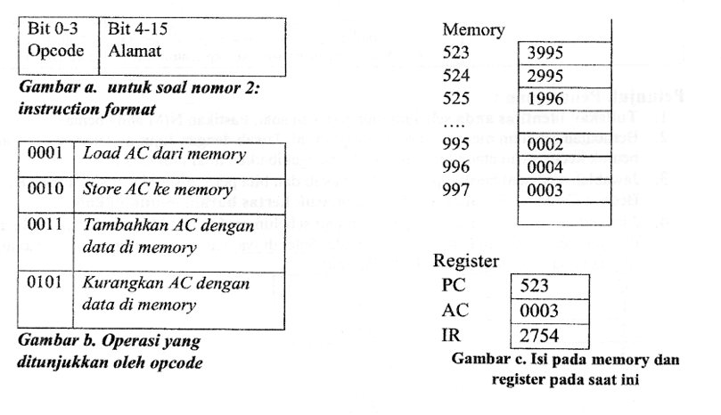

# UJIAN TENGAH SEMESTER GENAP 2023/2024

| Mata Kuliah    | : | Organisasi dan Arsitektur Komputer |
|----------------|:-:|-----------------------------------|
| Kelas          | : | A/B/C/D/E                         |
| Pengampu       | : | Rismiyati, B.Eng, M.Cs           |
|                | : | Dr. Sutikno, S.T., M.T             |
| Departemen     | : | Ilmu Komputer/Informatika         |
| Program Studi  | : | Informatika                       |
| Hari / Tanggal | : | Rabu/3 April 2024                 |
| Jam / Ruang    | : | 10.00-11.40 WIB (100 menit) / E101, E102, E103, A303 |
| Sifat Ujian    | : | Buku tertutup                      |

<br>

**CPL-07:**

*   Mampu menerapkan konsep sistem dan pengembangan perangkat lunak untuk menghasilkan solusi atas permasalahan kompleks di berbagai bidang dengan mempertimbangkan aspek keamanan.

<br>

**CPMK07-2:**

*   Mampu menerapkan konsep sistem untuk merancang solusi atas permasalahan kompleks

**Sub CPMK07-2:**

1.  Mahasiswa Mampu menjelaskan tentang konsep Organisasi dan Arsitektur Komputer dan *top view* dari sebuah system komputer
2.  Mahasiswa Mampu menjelaskan konsep organisasi sistem komputer, memory, Random Access Memory (RAM), Read Only Memory (ROM), *Chace Memory*: Mapping, Replacement Algoritma, Virtual Memory, Secondary Storage, input/output, peng-akses-an peralatan I/O, *interupt*, Direct Memory Access, antarmuka I/O standa.
3.  Mahasiswa Mampu menjelaskan tentang konsep sistem operasi dalam melakukan penjadwalan dan memory management
4.  Mahasiswa mampu menerapkan konsep Instruction set dan addressing mode untuk membuat perintah sederhana dalam bahasa assembly
5.  Mahasiswa memahami konsep dasarparallel; pipelining, data dan instruksi hazard, pengaruh set instruksi, parallel processing, multicore, GPU
6.  Mahasiswa memahami konsep control unit, multicore dan GPU


## SOAL **1. [CPMK07-2(1) bobot 20%]**

**a.** Sebuah prosesor dengan *clock speed* **2GHz** mengeksekusi sebuah program yang terdiri dari **1.000.000** instruksi. Instruksi tersebut terdiri dari beberapa kategori instruksi dengan detail sebagai berikut:

| Kategori | Prosentase | Cycle tiap instruksi |
|---|---|---|
| A | 30% | 10 |
| B | 40% | 20 |
| C | 20% | 40 |
| D | 10% | 60 |

Tentukan MIPS *rate* ketika program tersebut dieksekusi oleh processor! (10 pts)

**b.** 4 komponen utama dari komputer yaitu ..., ..., ..., dan ... (4 pts)

**c.** Jelaskan apa yang mempengaruhi peningkatan kecepatan menurut Amdahl Law, ketika dilakukan *parallel processing* (4 pts)

**d.** Register yang digunakan untuk menyimpan alamat memory dari data yang akan diakses disebut ... (2pts)


## JAWABAN 
**a. Perhitungan MIPS Rate**

1.  **Hitung Rata-rata CPI (Cycles Per Instruction):**
    CPI rata-rata = Σ (Persentase Kategori * Cycle tiap instruksi)
    CPI rata-rata = (0.30 * 10) + (0.40 * 20) + (0.20 * 40) + (0.10 * 60)
    CPI rata-rata = 3 + 8 + 8 + 6
    CPI rata-rata = 25 cycle/instruksi

2.  **Konversi Clock Speed ke Hz:**
    Clock Speed = 2 GHz = 2 * 10^9 Hz (cycle/detik)

3.  **Hitung MIPS Rate:**
    MIPS = Clock Speed / (CPI rata-rata * 10^6)
    MIPS = (2 * 10^9) / (25 * 10^6)
    MIPS = 2000 * 10^6 / (25 * 10^6)
    MIPS = 2000 / 25
    MIPS = 80

    Jadi, MIPS rate ketika program tersebut dieksekusi oleh processor adalah **80 MIPS**.

**b. 4 Komponen Utama Komputer**

Empat komponen utama dari komputer (berdasarkan arsitektur Von Neumann) adalah:
1.  **CPU (Central Processing Unit)** / Unit Pemroses Pusat
2.  **Memori Utama (Main Memory)** / Penyimpanan Primer
3.  **Perangkat Masukan (Input Devices)**
4.  **Perangkat Keluaran (Output Devices)**
*(Seringkali ditambahkan komponen ke-5 yaitu **Sistem Bus** yang menghubungkan ketiganya, atau **Storage Sekunder**)*

**c. Amdahl Law dan Parallel Processing**

Menurut Amdahl Law, faktor yang mempengaruhi (membatasi) peningkatan kecepatan ketika dilakukan *parallel processing* adalah **fraksi (bagian) dari program atau komputasi yang bersifat sekuensial (serial) dan tidak dapat diparalelkan**. Seberapa pun banyak prosesor atau sumber daya paralel yang ditambahkan untuk mempercepat bagian paralel, bagian sekuensial ini akan tetap membutuhkan waktu yang sama dan menjadi *bottleneck* yang membatasi *speedup* keseluruhan.

**d. Register Penyimpan Alamat Memori**

Register yang digunakan untuk menyimpan **alamat memori** dari data yang akan diakses disebut **MAR (Memory Address Register)**.

## SOAL 2. [CPMK07-2(2) bobot 20%]

**a.** Diketahui sebuah instruksi menggunakan format 16 bit. *Instruction format* ditunjukkan pada gambar (a). Operasi yang ditunjukkan oleh Opcode ditunjukkan pada Gambar (b).

Jika isi dari memory dan register **pada awalnya** ditunjukkan pada Gambar (c) dan diasumsikan tidak ada interrupt yang terjadi, tentukan isi dari masing-masing alamat memory 995-997 dan register PC,AC, **setelah instruksi pada baris 525 dieksekusi.**

(note : beri penjelasan ya 😉)
(10 pts)



**b.** urutkan dari yang tercepat ke yang terlambat :
RAM, Cache, Register, Hard disk, CD ROM (4 pts)

**c.** Jelaskan dengan gambar siklus instruksi sederhana/siklus secara umum, kapankah
prosesor melakukan pengecekan adanya interrupt! (6 pts)

## 3. [CPMK07-2(2) bobot 10%]

Diketahui sebuah komputer dengan *main memory* dengan jumlah word adalah 2<sup>16</sup>, dan ukuran masing-masing word adalah 1 byte. 1 block mempunyai ukuran 8 byte.
Asumsikan bahwa cache dengan *direct mapping* yang terdiri dari 32 baris digunakan pada mesin ini.

**a. Berapa byte ukuran cache tersebut? {4}**

**Jawaban:**

Ukuran cache dapat dihitung dengan mengalikan jumlah baris cache dengan ukuran block.

*   Jumlah baris cache = 32 baris
*   Ukuran block = 8 byte

Ukuran Cache = Jumlah baris cache × Ukuran block
Ukuran Cache = 32 baris × 8 byte/baris
Ukuran Cache = 256 byte

**Jadi, ukuran cache tersebut adalah 256 byte.**

**b. Gambarkan dan jelaskan bagaimana pembagian pengalamatan menjadi tag, line, dan word (clue panjang bit untuk alamat adalah 16 bit) {6}**

**Jawaban:**

**1. Penentuan Jumlah Bit untuk Setiap Field:**

*   **Word Offset (Byte Offset):**
    *   Ukuran block adalah 8 byte = 2<sup>3</sup> byte.
    *   Oleh karena itu, dibutuhkan **3 bit** untuk *word offset* untuk memilih byte dalam sebuah block.

*   **Line Number (Index):**
    *   Cache memiliki 32 baris = 2<sup>5</sup> baris.
    *   Oleh karena itu, dibutuhkan **5 bit** untuk *line number* untuk mengindeks baris cache.

*   **Tag:**
    *   Panjang alamat total adalah 16 bit.
    *   Jumlah bit untuk tag adalah sisa dari total bit alamat setelah dikurangi bit untuk *line number* dan *word offset*.
    *   Jumlah bit Tag = Total bit alamat - Bit *line number* - Bit *word offset*
    *   Jumlah bit Tag = 16 bit - 5 bit - 3 bit
    *   Jumlah bit Tag = 8 bit

**2. Gambaran Pembagian Pengalamatan:**

```
   15       8 |  7      3 |  2      0
  -----------------------------------
  |     Tag     | Line Number | Word Offset |
  -----------------------------------
  |   8 bits    |   5 bits    |   3 bits    |
  -----------------------------------
```

**3. Penjelasan Pembagian Pengalamatan:**

Dalam *direct mapping*, alamat memori dibagi menjadi tiga field: **Tag**, **Line Number**, dan **Word Offset**.

*   **Word Offset (3 bit):**  Field ini digunakan untuk memilih byte tertentu dalam sebuah block yang telah dipindahkan ke cache. Karena setiap block berukuran 8 byte, kita memerlukan 3 bit untuk mengalamati setiap byte (0 hingga 7) dalam block tersebut.

*   **Line Number (5 bit):** Field ini menentukan baris cache mana yang dapat digunakan untuk menyimpan block memori. Dalam *direct mapping*, setiap block memori hanya dapat dipetakan ke satu baris cache tertentu yang ditentukan oleh *line number*. Dengan 5 bit, kita dapat mengalamati 2<sup>5</sup> = 32 baris cache yang tersedia.  *Line number* ini didapatkan dari beberapa bit alamat memori.

*   **Tag (8 bit):** Field ini menyimpan bit-bit alamat memori yang tidak digunakan sebagai *line number* atau *word offset*.  Ketika CPU mencari data di cache, *line number* digunakan untuk menemukan baris cache yang potensial. Kemudian, *tag* yang disimpan di baris cache dibandingkan dengan *tag* dari alamat memori yang diminta.  **Hanya jika tag cocok (tag hit), dan data ditemukan di baris cache yang sesuai, maka cache hit terjadi.** Jika tag tidak cocok (tag miss), berarti data yang dicari tidak ada di baris cache yang diindeks oleh *line number* tersebut (cache miss), dan data harus diambil dari memori utama.

**Kesimpulan:**

Pembagian alamat ini memungkinkan sistem *direct mapping* untuk menentukan baris cache yang tepat untuk setiap block memori dan untuk memverifikasi apakah data yang dicari benar-benar ada di baris cache tersebut melalui perbandingan tag.

## 4. [CPMK07-2(2) bobot 10%]

Data yang disimpan di memory adalah **10110101**. Jika parity bit yang didapatkan ketika membaca memory adalah **0110**, tentukan apakah ada kesalahan pada data? Jika ada, tentukan data yang dibaca dari memory. jelaskan step by step jawaban anda (10)

**Jawaban:**

**Langkah-langkah:**

1.  **Data yang disimpan di memory:** 10110101
2.  **Parity bit yang didapatkan ketika membaca memory:** 0 (Kita akan mengasumsikan bahwa "parity bit yang didapatkan ketika membaca memory adalah 0110" berarti parity bit adalah bit pertama dari '0110', yaitu '0'.  Penting untuk dicatat bahwa format "0110" sebagai parity bit sangat tidak lazim karena parity bit seharusnya hanya 1 bit.  Namun, dengan keterbatasan informasi, kita akan menggunakan interpretasi ini untuk menjawab soal).
3.  **Jenis Parity:** Asumsikan *even parity* (parity genap) karena jenis parity tidak disebutkan, dan *even parity* adalah yang paling umum.
4.  **Hitung jumlah bit '1' pada data yang disimpan (10110101):** Terdapat 5 bit '1' dalam data 10110101.
5.  **Tentukan parity bit yang seharusnya (untuk even parity):** Untuk *even parity*, jumlah total bit '1' (data + parity bit) harus genap. Karena data 10110101 memiliki jumlah '1' yang ganjil (5), maka parity bit yang seharusnya adalah '1' untuk membuat jumlah total '1' menjadi genap (5 + 1 = 6, genap).
6.  **Bandingkan parity bit yang seharusnya ('1') dengan parity bit yang didapatkan ketika membaca memory ('0'):** Parity bit yang seharusnya ('1') tidak sama dengan parity bit yang didapatkan ketika membaca memory ('0').
7.  **Kesimpulan: Ya, ada kesalahan pada data.** Karena parity bit yang didapatkan tidak sesuai dengan parity bit yang seharusnya untuk data yang disimpan (dengan asumsi *even parity*).

**Data yang dibaca dari memory:**

Karena kita menggunakan parity bit sederhana, kita hanya dapat mendeteksi adanya kesalahan. Dengan parity bit tunggal, kita **tidak dapat mengoreksi kesalahan** atau secara pasti menentukan bit mana yang salah. Oleh karena itu, kita tidak dapat menentukan data yang *benar-benar* dibaca dari memory setelah terjadi kesalahan.

Namun, jika pertanyaan "tentukan data yang dibaca dari memory" diinterpretasikan sebagai data yang *mungkin* dibaca (yang kemungkinan besar salah karena deteksi kesalahan), maka kita dapat merujuk pada data yang diberikan dalam soal sebagai "parity bit yang didapatkan ketika membaca memory adalah **0110**".  Meskipun ini tidak secara langsung menjawab "data yang dibaca", dalam konteks keterbatasan koreksi kesalahan dengan parity sederhana, dan keanehan format "parity bit yang didapatkan adalah 0110" (yang mungkin adalah kesalahan penulisan soal),  jawaban yang paling masuk akal adalah menyatakan bahwa **terjadi kesalahan dan data yang dibaca kemungkinan besar korup**.

**Jawaban Akhir:**

**Ya, ada kesalahan pada data.**  Parity bit yang didapatkan ketika membaca memory (kita asumsikan bit pertama '0' dari '0110') tidak sesuai dengan parity bit yang seharusnya untuk data yang disimpan (10110101) dengan menggunakan *even parity*.  Karena menggunakan parity bit sederhana, kita hanya dapat mendeteksi kesalahan, dan **tidak dapat menentukan data yang benar yang dibaca dari memory**. Data yang dibaca kemungkinan besar mengalami kesalahan.

**Catatan:** Soal ini memiliki formulasi yang kurang jelas, terutama mengenai "parity bit yang didapatkan ketika membaca memory adalah 0110". Interpretasi *even parity* dan mengambil bit pertama dari '0110' sebagai parity bit digunakan untuk memberikan jawaban yang paling mungkin berdasarkan konteks soal tentang deteksi kesalahan parity.


## 5. [CPMK07-2(2) bobot 25%]

**a.** Sebuah *hard disk* mempunyai 100.000 *track*, dimana setiap *track* mempunyai 1000 *sektor*. Setiap sektor berukuran 512 Byte. Kecepatan berputar piringan disk tersebut adalah 14.400 rpm. Diasumsikan *head* awalnya berada pada *track* 0, dan *seek time* untuk setiap 1000 *track* adalah 2 ms. Berapakah total waktu untuk melakukan akses data sebesar 1024 Byte secara *random*? (*clue: total time terdiri dari komponen apa saja? Cari dulu masing2*) (16 pts)

**Jawaban a:**

Untuk menghitung total waktu akses data, kita perlu menjumlahkan komponen-komponen waktu akses yaitu: *seek time*, *rotational latency*, dan *transfer time*.

1.  **Seek Time:**
    *   Karena akses data bersifat *random*, kita asumsikan *head* perlu bergerak secara rata-rata setengah dari total jumlah track. Namun, untuk perhitungan yang lebih umum, kita sering menggunakan sepertiga dari total track sebagai perkiraan rata-rata *seek distance*.
    *   Rata-rata *seek distance* = (1/3) * Jumlah track = (1/3) * 100.000 track ≈ 33.333 track.
    *   *Seek time* untuk setiap 1000 track adalah 2 ms.
    *   Jumlah blok 1000-track yang perlu dilalui = 33.333 track / 1000 track/blok = 33,33 blok.
    *   Total *Seek Time* = 33,33 blok * 2 ms/blok ≈ **66,66 ms**.

2.  **Rotational Latency (Waktu Latensi Rotasi):**
    *   Kecepatan rotasi = 14.400 rpm (rotasi per menit).
    *   Konversi ke rps (rotasi per detik): 14.400 rpm / 60 detik/menit = 240 rps.
    *   Waktu untuk satu rotasi (Periode) = 1 detik / 240 rotasi = 1/240 detik ≈ 0,0041667 detik = 4,1667 ms.
    *   Rata-rata *rotational latency* adalah setengah dari waktu rotasi penuh.
    *   Rata-rata *Rotational Latency* = 0,5 * Waktu rotasi = 0,5 * 4,1667 ms ≈ **2,08 ms**.

3.  **Transfer Time (Waktu Transfer):**
    *   Data yang diakses = 1024 Byte.
    *   Ukuran sektor = 512 Byte.
    *   Jumlah sektor yang diakses = 1024 Byte / 512 Byte/sektor = 2 sektor.
    *   Waktu untuk membaca 1 sektor = Waktu rotasi / Jumlah sektor per track = 4,1667 ms / 1000 sektor = 0,0041667 ms/sektor.
    *   *Transfer Time* untuk 2 sektor = 2 sektor * 0,0041667 ms/sektor ≈ **0,0083 ms**.

4.  **Total Access Time (Total Waktu Akses):**
    *   Total Waktu Akses = *Seek Time* + *Rotational Latency* + *Transfer Time*
    *   Total Waktu Akses = 66,66 ms + 2,08 ms + 0,0083 ms ≈ **68,7483 ms**.

    **Dibulatkan, total waktu untuk mengakses data 1024 Byte secara random adalah sekitar 68,75 ms.**

**b. Lengkapilah tabel berikut ini untuk menentukan level RAID (9 pts)**

**Jawaban b:**

| Apakah ada Redundancy                                      | Organisasi data                                     | Level RAID? |
|-----------------------------------------------------------|------------------------------------------------------|-------------|
| Tidak ada redundancy tetapi sudah mampu menghandle parallel processing | lebih besar dari word, tetapi lebih kecil dari block | **RAID 0**  |
| Redundancy disimpan dalam bentuk paritas pada single disk     | Dalam bentuk word/byte                               | **RAID 2**  |
| Redundancy disimpan dalam bentuk single paritas yang diletakkan secara terdistribusi | Dalam bentuk block                                  | **RAID 5**  |

**Penjelasan Tabel RAID Level:**

*   **RAID 0 (Striping):**  Tidak memiliki redundancy. Data di-stripe (dipotong dan disebar) di seluruh disk untuk meningkatkan performa baca/tulis paralel. Cocok untuk aplikasi yang membutuhkan kecepatan tinggi dan tidak terlalu kritis terhadap kehilangan data.
*   **RAID 2 (Bit-level Striping with Dedicated Parity):** Menggunakan *bit-level striping* dan memiliki disk-disk khusus untuk menyimpan parity. Parity dihitung per bit kolom data. Meskipun memiliki redundancy, RAID 2 jarang digunakan karena kompleksitas dan performa yang tidak lebih baik dari level RAID lain yang lebih sederhana.
*   **RAID 5 (Block-level Striping with Distributed Parity):** Menggunakan *block-level striping* dan mendistribusikan informasi parity di seluruh disk.  Jika satu disk gagal, data masih dapat direkonstruksi dari disk-disk lain dan parity. RAID 5 menawarkan keseimbangan yang baik antara performa, kapasitas penyimpanan yang efisien, dan redundancy, sehingga sangat umum digunakan.

## 6. [CPMK07-2(3) bobot 15%]

**a.** Pada *programmed IO*, setelah mengeluarkan perintah baca, processor akan terus menerus melakukan pengecekan status dari komponen yang bernama ....(2 pts)

**Jawaban a:**

Pada *programmed IO*, setelah mengeluarkan perintah baca, processor akan terus menerus melakukan pengecekan status dari komponen yang bernama **I/O Module (atau I/O Controller atau Device Controller)**.

**Penjelasan:**
Dalam *programmed IO*, processor secara aktif terlibat dalam seluruh proses transfer data antara memori dan perangkat I/O. Setelah memberikan perintah (misalnya, perintah baca), processor harus terus-menerus memeriksa status dari I/O Module. Pengecekan status ini biasanya dilakukan melalui *status register* yang ada di dalam I/O Module. Processor menunggu (looping) dan membaca *status register* ini berulang kali sampai I/O Module menandakan bahwa operasi (misalnya, pembacaan data) telah selesai dan data siap untuk diambil.

**b.** Cara interaksi IO dan computer dimana terdapat modul tambahan yang akan menggantikan peran processor dalam transfer data dari dan ke IO langsung ke memory disebut...(2 pts)

**Jawaban b:**

Cara interaksi IO dan komputer dimana terdapat modul tambahan yang akan menggantikan peran processor dalam transfer data dari dan ke IO langsung ke memory disebut **DMA (Direct Memory Access)**. Modul tambahan tersebut adalah **DMA Controller**.

**Penjelasan:**
*DMA (Direct Memory Access)* adalah teknik transfer data yang memungkinkan perangkat I/O untuk mentransfer data langsung ke atau dari memori utama tanpa melibatkan processor secara aktif dalam setiap langkah transfer.  Peran processor dalam transfer data digantikan oleh **DMA Controller**.  Processor hanya menginisiasi transfer DMA dengan memberikan informasi seperti alamat memori sumber/tujuan, jumlah data yang akan ditransfer, dan arah transfer. Setelah inisiasi, DMA Controller mengambil alih kendali bus sistem dan melakukan transfer data secara langsung. Setelah transfer selesai, DMA Controller biasanya memberi tahu processor melalui interrupt.

**c.** Setelah process dijalankan di processor, process kemungkinan akan menempati tiga state/kondisi yaitu ..., ..., dan ... (3)

**Jawaban c:**

Setelah proses dijalankan di processor, proses kemungkinan akan menempati tiga state/kondisi yaitu: **Running**, **Ready**, dan **Blocked (atau Waiting)**.

**Penjelasan:**
Proses dalam sistem operasi umumnya melalui siklus hidup yang melibatkan berbagai state. Tiga state dasar yang umum adalah:
*   **Running:** Proses sedang dieksekusi oleh processor. Pada satu waktu, hanya satu proses (atau beberapa proses dalam sistem multiprosesor) yang bisa berada dalam state *running* pada setiap core processor.
*   **Ready:** Proses siap untuk dieksekusi, tetapi saat ini processor sedang digunakan oleh proses lain. Proses *ready* menunggu giliran untuk mendapatkan waktu CPU dan masuk ke state *running*.
*   **Blocked (atau Waiting):** Proses tidak dapat dijalankan saat ini karena sedang menunggu suatu kejadian terjadi, seperti selesainya operasi I/O, tersedianya sumber daya, atau penerimaan sinyal dari proses lain. Proses akan berpindah ke state *ready* setelah kejadian yang ditunggunya terjadi.

**d.** Konsekuensi jika terlalu banyak program dibuka di dalam satu waktu, akan mengakibatkan computer menjadi sangat lambat dalam bekerja. Dalam konteks memory management, hal ini dapat disebabkan karena operating system menggunakan demand paging. Jelaskan kenapa demand paging dapat mengakibatkan hal tersebut! (8 pts)

**Jawaban d:**

Demand paging dapat mengakibatkan komputer menjadi sangat lambat ketika terlalu banyak program dibuka secara bersamaan karena fenomena **thrashing**.

**Penjelasan Thrashing dalam Demand Paging:**

*   **Demand Paging:** Demand paging adalah teknik manajemen memori virtual di mana halaman-halaman (pages) dari suatu proses hanya dimuat ke memori fisik (RAM) ketika halaman tersebut benar-benar dibutuhkan (on demand). Halaman yang tidak aktif disimpan di disk (secondary storage atau swap space).
*   **Terlalu Banyak Program:** Ketika terlalu banyak program dibuka, setiap program membutuhkan sejumlah halaman untuk dieksekusi. Jika jumlah total halaman yang dibutuhkan oleh semua program aktif melebihi kapasitas RAM fisik yang tersedia, maka operating system harus sering melakukan *page swapping* (pertukaran halaman).
*   **Page Fault:** Ketika proses mencoba mengakses halaman yang tidak ada di RAM (karena belum dimuat atau sudah di-swap out), terjadi *page fault*. Sistem operasi harus menginterupsi proses yang sedang berjalan, mencari halaman yang diminta di disk, memuat halaman tersebut ke RAM (mungkin menggantikan halaman lain yang ada di RAM - *page replacement*), dan kemudian melanjutkan eksekusi proses.
*   **Thrashing:** Jika terlalu banyak proses aktif dan masing-masing proses membutuhkan banyak halaman, sistem operasi akan menghabiskan sebagian besar waktunya untuk melakukan *page swapping* antara RAM dan disk.  Prosesor menjadi sibuk menangani *page fault* dan *page replacement*, dan hanya sedikit waktu yang tersisa untuk eksekusi program yang sebenarnya.  Kondisi ini disebut **thrashing**. Dalam keadaan thrashing, utilisasi CPU menurun drastis karena sebagian besar waktu dihabiskan untuk aktivitas swapping, bukan untuk komputasi produktif.  Akibatnya, komputer terasa sangat lambat dan tidak responsif.

**Singkatnya, demand paging menjadi tidak efisien dan menyebabkan kelambatan (thrashing) ketika permintaan memori total dari program-program aktif jauh melebihi RAM fisik, sehingga memicu frekuensi page fault dan swapping yang sangat tinggi.**